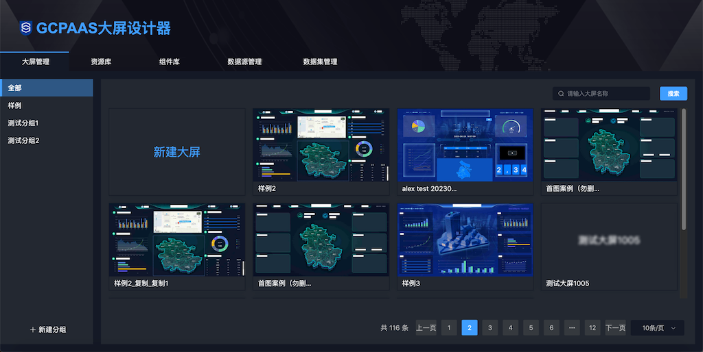
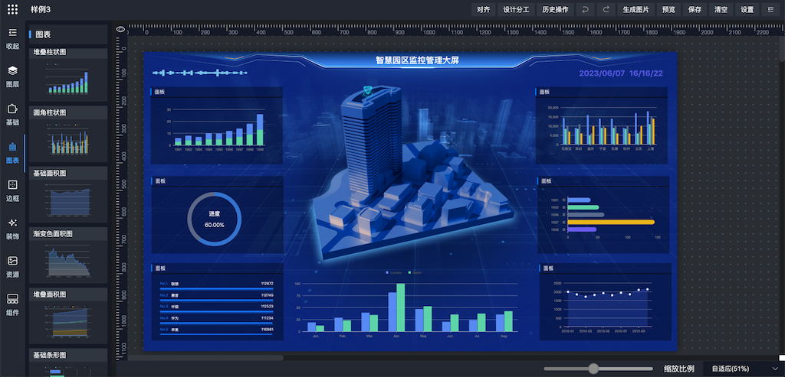
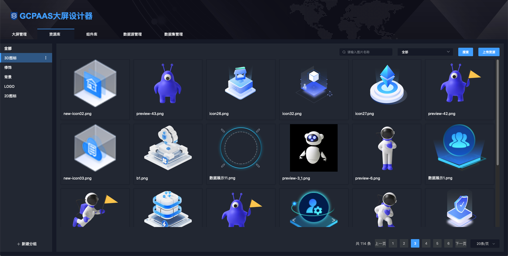
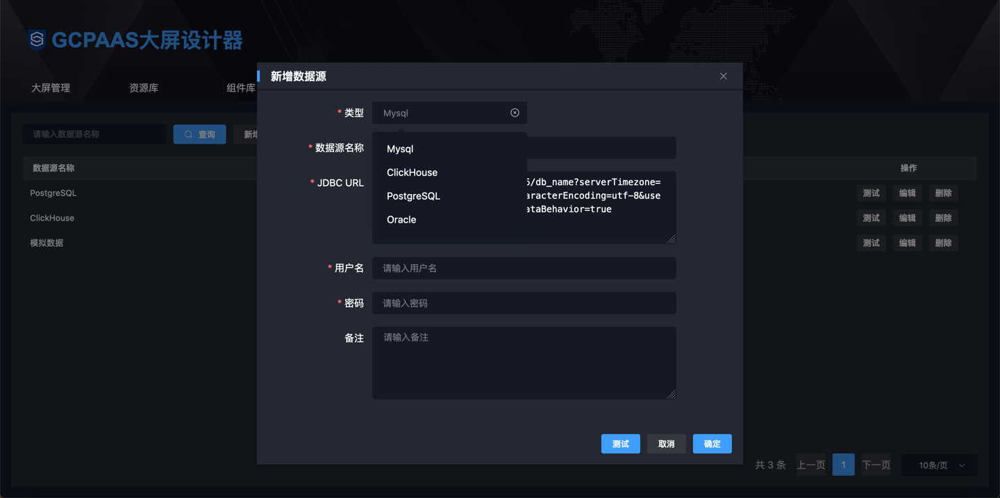
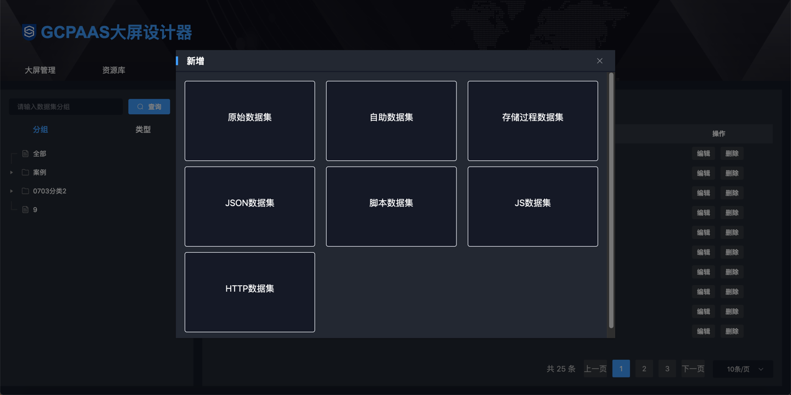
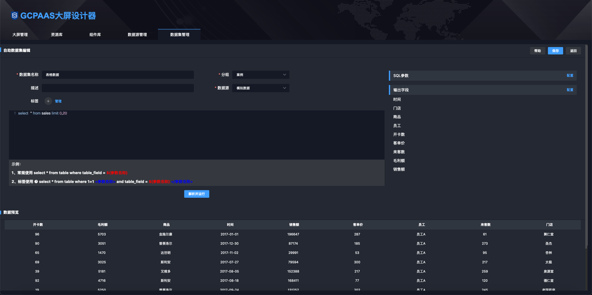
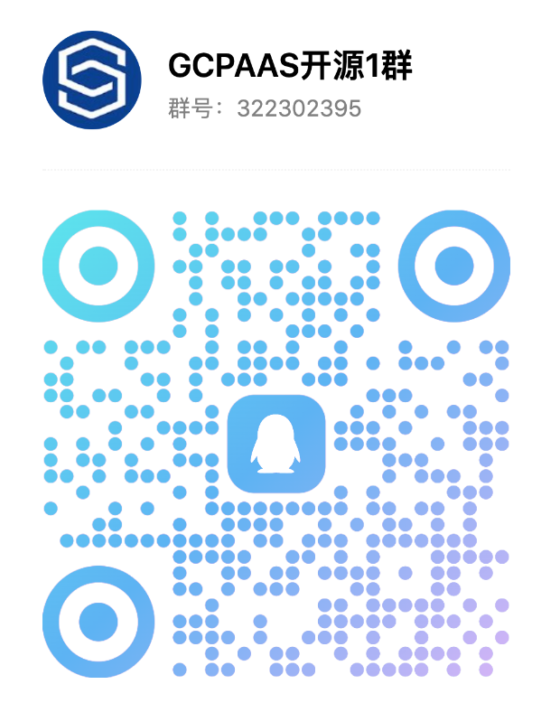
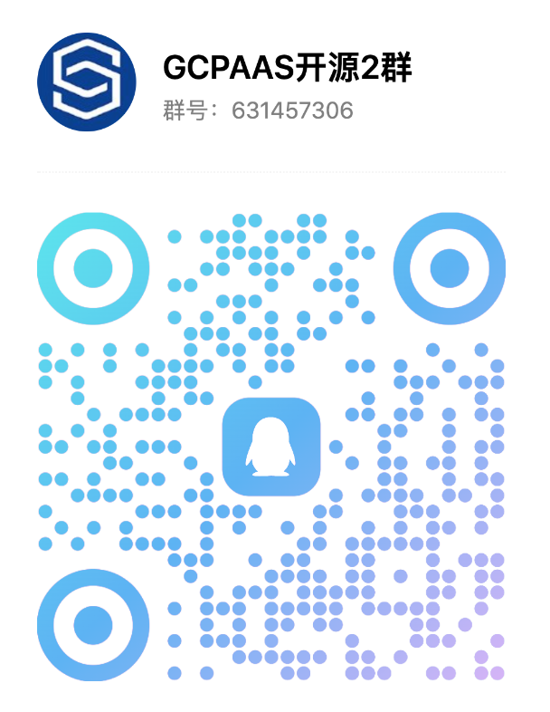

  <h1>DataRoom</h1>
  <strong>简单、免费、开源的大屏设计器</strong>

    
    
    
    
    

🔥DataRoom是一款基于SpringBoot、MyBatisPlus、Vue、ElementUI、G2Plot、Echarts等技术栈的大屏设计器，具备大屏设计、预览能力，支持MySQL、Oracle、PostgreSQL、SQLServer、ElasticSearch、JSON、JS、HTTP、Groovy等数据集接入，使用简单，完全免费，代码开源。 

**最新版本**   

## 功能介绍

### 1. 大屏管理

支持大屏【新增】、【编辑】、【设计】、【预览】、【复制】、【删除】操作

 

### 2. 设计器

采用拖拉拽可视化设计，支持30+基础组件、40+种图表组件、15种边框组件、10多种修饰组件

 

### 3. 资源库

支持资源自定义上传、在大屏设计器中直接引用资源，如：3D图片、边框图片、装饰条、背景图

 

### 4. 数据源

支持MySQL、PostgreSQL、Oracle 、ClickHouse、SqlServer数据库接入

 

### 5. 数据集

支持原始数据集、自助数据集、存储过程数据集、JSON数据集、脚本数据集、JS脚本数据集、HTTP数据集多种方式接入数据

 

 

## 优势

✅ 一站式大屏解决方案，从**数据源接入**->**数据清洗处理**->**大屏设计**->**大屏预览**->**大屏发布上线** 
✅ 支持**多种数据集接入**，如：原始数据集、自助数据集(支持多表关联)、存储过程、JSON(静态数据)、JS脚本、Groovy脚本、ElasticSearch、HTTP接口，满足大多数数据接入需求 
✅ 支持大屏🔥**独立部署**，不对原有工程产生影响，适用于老项目 
✅ 支持大屏🔥**嵌入式集成**，引入依赖包即可，与项目无缝融合，无其他系统框架依赖，减少运维成本，适用于新项目 
✅ 支持🔥**组件在线、离线开发**，在线开发业务组件、离线开发系统组件，轻松解决图表不满足需求问题 
✅ 支持自定义接口权限、数据权限，轻松对接🔥**Shiro、Security**等认证框架，保证大屏数据安全 

 

## 特性

| 特性                                                         | |
| --- | :-- |
| 支持大屏、设计、预览、导出图片                     | ✅        |
| 支持图层上下调整，支持置于顶层、置于底层                     | ✅    |
| 支持画布组件任意框选、组合、取消组合、锁定、批量删除、复制功能 | ✅    |
| 支持多组件框选后对齐，如：左对齐、右对齐、上对齐、下对齐、中部对齐、水平均分、垂直均分 | ✅ |
| 支持文本、超链接、时间选择器、输入框、按钮、Tab标签、图片、轮播表、播放器、排名表、翻牌器、基础表格、倒计时、系统时间、外链集成、主题切换基础组件 | ✅    |
| 支持折线图、柱状图、面积图、条形图、饼图、环图、水波图、仪表盘、进度条、词云图、雷达图、漏斗图、梯形图、中国地图、飞线图等图表组件 | ✅    |
| 支持组件库，包含系统组件、业务组件、自定义组件，在线编辑器二次开发业务或自定义图表组件 | ✅ |
| 支持图表数据定时刷新能力 | ✅ |
| 支持15种边框组件，具备动画、渐变色设置                     | ✅    |
| 支持10多种修饰组件，具备动画、渐变色设置                     | ✅    |
| 支持资源库，包含LOGO、3D图标、2D图标、修饰条、背景图等上百个大屏设计资源，资源支持自定义上传 | ✅    |
| 支持多种数据源，目前支持MySQL、PostgreSQL、Oracle、ClickHouse数据库 | ✅    |
| 支持多种数据集，目前支持原始数据集、自助数据集(支持多表关联)、存储过程数据集、JSON数据集(静态数据)、JS数据集、Groovy脚本数据集、ElasticSearch数据集、HTTP数据集，接入不同数据来源 | ✅    |
| 支持自定义接口权限、数据权限，可对接项目已有权限管理完成对大屏的安全管控 | ✅    |
| 支持老项目外链集成、新项目依赖包集成 | ✅    |

 

## 快速开始

1️⃣ 如果你想源码启动体验，[请点击这里](https://www.yuque.com/chuinixiongkou/bigscreen/ofy1bqhqgua1fu0f)

2️⃣ 如果你想使用Docker启动体验 ，[请点击这里](https://www.yuque.com/chuinixiongkou/bigscreen/ahhq3i7zxea46ox2)

3️⃣ 如果你想将大屏集成到项目中，[请点击这里](https://www.yuque.com/chuinixiongkou/bigscreen/ofy1bqhqgua1fu0f)

4️⃣ 如果你想设计一个大屏，[请点击这里](https://www.yuque.com/chuinixiongkou/bigscreen/ofy1bqhqgua1fu0f)

5️⃣ 如果你想独立部署大屏，[请点击这里](https://www.yuque.com/chuinixiongkou/bigscreen/xd78cw7t12q7kfbl#gGrS2)

 

## 演示环境

演示环境会不定时进行更新  <a href="http://gcpaas.gccloud.com/bigScreen" target="_blank">点击立即体验</a>**（请不要在演示环境中放入生产数据）**

 

## 常见问题

⚠️&nbsp;&nbsp;[使用手册、二次开发、部署手册、常见问题](https://www.yuque.com/chuinixiongkou/bigscreen/index) 
⚠️&nbsp;&nbsp;[(码云仓库](https://gitee.com/gcpaas/DataRoom) 
⚠️&nbsp;&nbsp;[GitHub仓库](https://github.com/gcpaas/DataRoom) 

## 生态插件

| 组件         | 地址                                                         |
| ------------ | ------------------------------------------------------------ |
| 大屏设计器   | [码云](https://gitee.com/gcpaas/DataRoom)、[GitHub](https://github.com/gcpaas/DataRoom) |
| 仪表盘设计器 | [码云](https://gitee.com/gcpaas/DashBoard)、[GitHub](https://github.com/gcpaas/DashBoard) |
| 数据集       | [码云](https://gitee.com/gcpaas/dataset)、[GitHub](https://github.com/gcpaas/dataset) |

 

## 联系我们
<table>
    <tr>
        <td style="text-align: center;font-weight: bold;">
群1(已满)

</td>
        <td style="text-align: center;font-weight: bold;">
群2

</td>
    </tr>
</table>

## 许可证

Apache License 2.0