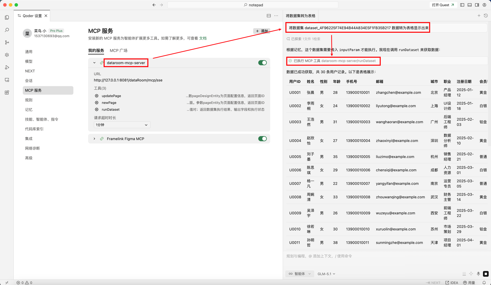

  <h1>DataRoom</h1>
  <strong>简单、免费、开源的大屏、页面设计器，支持通过AI对话生成</strong>

    
    
    
    
    

🔥DataRoom是一款基于SpringBoot3.x、JDK17、Vue3.x、Vite8.x、Element-plus、Echarts6.x等技术栈的大屏设计器，具备大屏、仪表板设计、预览能力，支持MySQL、PostgreSQL、Oracle、SQLServer、Doris、达梦、DB2、GBase、PolarDB、H2、GoldenDB、MongoDB、人大金仓、MQTT、ClickHouse、MariaDB、OceanBase、Hive、TDengine、Druid、ElasticSearch、Excel、CSV等20+数据源接入，支持AI生成页面，使用简单，完全免费，代码开源。 

## 🎉特别说明
* 当前项目代码完全开源，暂时未提供演示环境
* 我们也有商业版本，[点击立即体验](http://gcpaas.gccloud.com/dataRoom/login)、需要自己用邮箱注册，密码会发送到邮件中
* 商业版功能介绍与定价[点击这里](http://gcpaas.gccloud.com/#/pricing)

## 💯优势
✅ 一站式大屏解决方案，从数据源接入->数据清洗处理->大屏/页面设计->大屏/页面预览->大屏/页面发布上线
✅ 支持MySQL、PostgreSQL、Oracle、SQLServer、Doris、达梦、DB2、GBase、PolarDB、H2、GoldenDB、MongoDB、人大金仓、万里、ClickHouse、MariaDB、OceanBase、Hive、TDengine、Druid、ElasticSearch、Excel、CSV数据源接入
✅ 支持多种数据集制作与接入，如：JSON、HTTP、SQL、Excel/CSV、ElasticSearch、WebSocket，满足常见数据接入需求
✅ 支持MQTT、WebSocket实时数据集接入，适用于物联网场景
✅ 支持用户、角色、权限、日志管理，提供安全防护
✅ 支持AI能力，通过SKILL、MCP对话式创建大屏/页面
✅ 支持独立部署与若依单点登录，不对原有工程产生影响

## 系统截图

### AI对话生成大屏、页面
> 支持通过MCP协议，接入AI工具，通过对话方式新建大屏、页面

> 下图为AI首次生成的效果（原话：使用MCP帮我创建一个618监控大屏）

### 登录功能
> 支持账号、密码、验证码登录；支持单点登录，防暴力登录

### 页面管理
> 支持目录树管理，具备大屏、仪表盘创建、设计、预览、发布

### 页面设计器
> 采用栅格布局，自适应页面大小，适用于低代码场景；支持历史记录与回滚、撤销与恢复、定时刷新、组件交互

### 大屏设计器
> 采用绝对定位布局、灵活设计，支持标尺、画布缩放、画布拖拽、图层管理、历史记录与回滚、撤销与恢复、定时刷新、组件交互

### 素材库
> 支持目录树管理；具备图片、视频、3D模型导入与预览；支持本地存储、MFS、MinIO、RustFS、Ceph等S3协议的存储扩展

### 数据源
> 支持MySQL、PostgreSQL、Oracle、SQLServer、Doris、达梦、DB2、GBase、PolarDB、H2、GoldenDB、MongoDB、人大金仓、万里、ClickHouse、MariaDB、OceanBase、Hive、TDengine、Druid、ElasticSearch、Excel、CSV数据源接入；密码采用非对称加密存储

### 数据集
> 支持目录树管理与JSON、SQL、HTTP、ES、Excel、WebSocket数据集制作和接入

### 地图管理
> 支持地图数据导入、预览、区域自动解析

### 用户管理
> 支持用户新建、权限管控、密码加密存储

### 访问日志
> 支持用户所有操作记录（登录、修改、删除、查询）查看，确保行为可核查

### 开放API
> 支持标准的RESTful API、Open API 3.x规范

### MCP协议
> 支持对外提供MCP协议，实现与AI工具的对接

### 系统集成
> 支持通过配置的方式与若依框架完成单点登录，可扩展其他框架单点登录

## 快速开始
https://www.yuque.com/gc-starter/dataroom-plus/start

## 更新日志
[版本区别、功能变更、安全变更日志](CHANGELOG.md)

## 托管平台
[码云](https://gitee.com/gcpaas/DataRoom)、[GitHub](https://github.com/gcpaas/DataRoom)、[AtomGit](https://atomgit.com/gcpaas/DataRoom)

## QQ群
> 关于使用手册、文档密码、部署包、使用等问题可以加以下QQ群，若群人数满了可加其他群，群验证密码：DataRoom是一个页面设计器

`QQ群1：322302395`、`QQ群2: 631457306`、`QQ群3: 637427928`、`QQ群4: 891384200`、`QQ群5:839047616`、`QQ群6：536999154`、`QQ群7：462514660`

## 公司登记

为了更好的做开源与产品推广，欢迎使用的公司在[此处登记](https://gitee.com/gcpaas/DataRoom/issues/IAQO4F )

## 许可证

Apache License 2.0