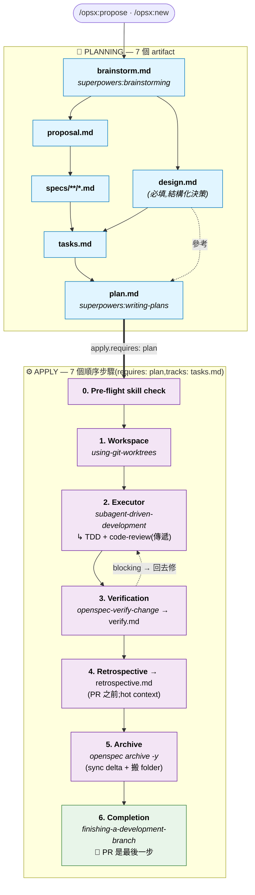

# superpowers-bridge Schema

[English](./README.md) · [繁體中文](./README.zh-TW.md)

[](https://github.com/JiangWay/openspec-schemas/actions/workflows/validate-schemas.yml)
[](https://github.com/JiangWay/openspec-schemas/issues?q=is%3Aopen+label%3Aupstream-version-check)
[](#相容性)
[](#相容性)

> 把 [OpenSpec](https://github.com/Fission-AI/OpenSpec) 的 artifact 治理流程(**做什麼**)與 [obra/superpowers](https://github.com/obra/superpowers) 的執行技能(**怎麼做**)整合為單一工作流。額外提供 evidence-first 的 `retrospective` artifact,補上 Superpowers 沒有的 retro 能力。
>
> 整合**完全發生在 prompt 層**——不修改 Superpowers 任何程式碼,不修改 OpenSpec CLI。Schema 版本:v1。

---

## 安裝

### 方法 1:Claude Code 一鍵 prompt(推薦)

在你專案的根目錄打開 Claude Code,把下面這段貼進去:

```
Install the superpowers-bridge schema for OpenSpec into this project:

1. Verify the project has an `openspec/` directory (run `openspec init` if missing).
2. Clone https://github.com/JiangWay/openspec-schemas to a temp dir.
3. Copy the `superpowers-bridge/` subdirectory to `openspec/schemas/superpowers-bridge/`.
4. Run `openspec schema validate superpowers-bridge` to verify.
5. Run `openspec schemas` and confirm `superpowers-bridge` is listed.
6. If a CLAUDE.md exists at the project root, ask me whether to insert the workflow-routing fragment from `openspec/schemas/superpowers-bridge/templates/adopters/CLAUDE.md.fragment.<locale>.md` (auto-detect locale from existing CLAUDE.md content; default zh-TW for Traditional Chinese, no suffix for English). If I say yes, append the fragment as a new section. If no CLAUDE.md exists, skip.
7. Clean up the temp directory.
8. Verify Superpowers plugin is installed by running `claude plugin list`.
   If not listed, run `claude plugin install superpowers@claude-plugins-official`.
9. Show me the final state.
```

### 方法 2:手動 bash(CI / 非 Claude 環境)

```bash
git clone https://github.com/JiangWay/openspec-schemas /tmp/oss
cp -R /tmp/oss/superpowers-bridge ~/your-project/openspec/schemas/superpowers-bridge

# 可選:把 workflow-routing fragment 插進 CLAUDE.md
# cat /tmp/oss/superpowers-bridge/templates/adopters/CLAUDE.md.fragment.md      # 英文
# cat /tmp/oss/superpowers-bridge/templates/adopters/CLAUDE.md.fragment.zh-TW.md  # 繁中

rm -rf /tmp/oss
cd ~/your-project
openspec schema validate superpowers-bridge
claude plugin install superpowers@claude-plugins-official  # 若尚未安裝
```

---

## 升級已採用本 schema 的專案

如果你的專案早已在 `openspec/schemas/superpowers-bridge/` 安裝過本 schema,想拿到最新版本,執行下列其中一種升級方式。升級會整個覆蓋 `superpowers-bridge/` 目錄,並提供 CLAUDE.md 片段更新 — 詳情見下方「升級會【覆蓋】什麼?」。

### 升級方法 1:Claude Code 一鍵 prompt(推薦)

在你專案的根目錄打開 Claude Code,把下面這段貼進去:

```
Upgrade the superpowers-bridge schema in this project:

1. Verify `openspec/schemas/superpowers-bridge/` already exists (upgrade, not fresh install). If missing, abort and tell me to use the install instructions instead.
2. Clone https://github.com/JiangWay/openspec-schemas to a temp dir.
3. Show me the diff between the local `openspec/schemas/superpowers-bridge/` and the cloned `superpowers-bridge/` (use `diff -ruN`). Wait for my ack before overwriting.
4. After my ack, overwrite the local schema dir with the cloned one.
5. Run `openspec schema validate superpowers-bridge` to verify.
6. Check whether this project has `CLAUDE.md` at the repo root.
   - If yes: scan it for an existing workflow-routing section referencing superpowers-bridge.
     - If found: show me the diff between that section and `superpowers-bridge/templates/adopters/CLAUDE.md.fragment.<locale>.md`. Wait for my ack before replacing.
     - If not found: ask whether to insert the new fragment from `templates/adopters/CLAUDE.md.fragment.<locale>.md`.
   - If no CLAUDE.md exists: skip.
7. Clean up the temp directory.
8. Show me the final state.
```

> `<locale>` 預設 `zh-TW`(若你 CLAUDE.md 是繁中)或省略(英文)。Claude 會依你 CLAUDE.md 的既有語言判斷。

### 升級方法 2:手動 bash

```bash
# 1. 取最新的 bundle
git clone https://github.com/JiangWay/openspec-schemas /tmp/oss-upgrade

# 2. 先看差異(不直接覆蓋)
diff -ruN ~/your-project/openspec/schemas/superpowers-bridge /tmp/oss-upgrade/superpowers-bridge

# 3. 確認 diff 後再覆蓋
rm -rf ~/your-project/openspec/schemas/superpowers-bridge
cp -R /tmp/oss-upgrade/superpowers-bridge ~/your-project/openspec/schemas/superpowers-bridge

# 4. 驗證
cd ~/your-project && openspec schema validate superpowers-bridge

# 5. CLAUDE.md fragment(手動處理)
# 看 /tmp/oss-upgrade/superpowers-bridge/templates/adopters/CLAUDE.md.fragment.zh-TW.md
# 比對自己 CLAUDE.md 是否要插入或更新對應段落

# 6. 清理
rm -rf /tmp/oss-upgrade
```

### 升級會【覆蓋】什麼?

| 路徑 | 行為 | 是否需手動 |
|---|---|---|
| `openspec/schemas/superpowers-bridge/` | 自動整個目錄覆蓋 — 從 upstream 整包換新(Method 2 是 `rm -rf` + `cp -R`,Method 1 等價) | 不需 |
| `CLAUDE.md`(專案根) | schema 目錄附 `templates/adopters/CLAUDE.md.fragment.<locale>.md` 片段;升級流程會把你的 CLAUDE.md 跟此片段 diff 給你看,等你 ack 才插入或更新 | 需要 — 確認 diff,選擇插入 / 取代 / 保留現有 |

> bridge 目錄是 monolithic — 要嘛整包換新版,要嘛留舊版,**沒有逐檔 opt-in**。CLAUDE.md 是升級流程唯一會碰專案根目錄的檔案,而且永遠等你 ack。

> In-flight change(任一 phase:brainstorm / design / specs / ...)仍合法 — schema graph(`requires:` edges、PRECHECKs、artifact 依賴)在 v1.x 沒有變動。升級前產出的 `verify.md` / `retrospective.md` 仍可讀;若對它們重跑 `/opsx:verify` 或 `/opsx:continue → retrospective`,會用新 template 結構覆蓋。

> 未來若 schema graph 結構性變動(增刪 artifact、改 `requires:` edges、PRECHECK 變動),會在 README 上方加版本欄位 + 提供 migration guide;v1 → v1.x 純 instruction prose 改動安全,不需 migration。

---

## 這個 schema 解決什麼問題?

OpenSpec 管 **「做什麼」**(artifact 生命週期:proposal / specs / tasks / verify 等)。Superpowers 管 **「怎麼做」**(執行紀律:brainstorming、writing-plans、TDD、code review)。各自堅實,但實際開發中交替使用會出現三個結構性問題:

1. **產出重複** — brainstorming 寫設計到 `docs/superpowers/specs/`,OpenSpec 又在 change 目錄重寫 `proposal.md` / `design.md`,內容高度重疊。
2. **Task 分裂** — OpenSpec 的 `tasks.md`(粗粒度 checkbox)和 Superpowers 的 `plan.md`(TDD micro-step)描述同一件事,但格式、位置、追蹤各自獨立。
3. **手動編排** — 使用者要自己判斷現在該用哪個 skill,兩個系統不會自己銜接。

### 為什麼用自定義 schema 而非修改現有 skill?

兩個替代方案被排除:

- **在 `config.yaml` 加自定義欄位**(例如 `skill_bindings`):OpenSpec CLI 不認識這些欄位,沒有驗證、沒有發現性,且需要修改多個 SKILL.md 才能讀取。
- **直接修改 opsx skill 檔**:侵入性高(影響每個 change),且 SKILL.md 升版時會被覆蓋。

自定義 schema 用的是 OpenSpec **原生支援的專案級 schema 機制**:CLI 驗證結構、`openspec schemas` 自動列出、每個 change 獨立選擇 schema(`--schema spec-driven` 或 `--schema superpowers-bridge`)、不修改任何現有 SKILL.md 或 command 檔案。

---

## 進入與離開的判斷(Entry & exit gates)

本 schema 的 instruction 只在 `/opsx:*` 指令啟動 artifact 時才注入 prompt。如果你以 narrative 方式觸發 Superpowers skill(例如直接對 Claude 說「我們討論一下架構」),預設行為會繞過本 schema —— brainstorming 仍會寫到 `docs/superpowers/specs/`,讓整合的 redirection 完全失效。

這一段告訴你三件事:

1. 何時根本不需要進入本 schema(直接 PR 即可)
2. 已經在 verbal brainstorm,何時該升級成 opsx change
3. 進入本 schema 時要避開的 front-door 反模式

### 何時不進入本 schema(直接 PR)

並非每個改動都要走 change 流程。下列情境**不需要**建 change:

| 情境 | 是否要建 change | 怎麼做 |
|---|---|---|
| 新功能 / 新 capability | ✅ 要 | `/opsx:new <name> --schema superpowers-bridge` |
| Breaking change | ✅ 要 | 同上 |
| 架構變更 | ✅ 要 | 同上 |
| Bug fix(恢復原本行為,不變更合約) | ❌ 不要 | 直接 PR |
| 測試補寫 / 覆蓋率 | ❌ 不要 | 直接 PR |
| 建置工具微調(linter 規則、覆蓋率門檻等) | ❌ 不要 | 直接 PR |
| 非破壞性依賴升級 | ❌ 不要 | 直接 PR |
| 文件更新 / typo 修正 | ❌ 不要 | 直接 PR |
| Config 值微調(不動結構) | ❌ 不要 | 直接 PR |

> 原則:**流程儀式跟風險成正比**。動到對外合約、跨系統介接、DB schema、合規邊界 → 走 change;改 typo、抓 bug、調 timeout 數字 → 直接 PR。模糊地帶用下方 5 條 checklist 自我檢驗。

### 進行中的 verbal brainstorm 何時升級成 change

如果使用者以 narrative(「我們來討論架構」「腦力激盪一下」)觸發了 `superpowers:brainstorming`,brainstorming 的產出**不可以**寫到 `docs/superpowers/specs/` —— 那會繞過本 schema 的 output redirection,在 repo 裡留下 orphan artifact。

正確流程:在以下 5 條判準**全部滿足**之前,維持 verbal brainstorm;全滿足時升級到 `/opsx:propose` 或 `/opsx:new`,讓 brainstorming 的對話結論落到 `openspec/changes/<name>/brainstorm.md`。

1. **Scope 鎖定** —— 一句話講清「包含什麼、不包含什麼」,且不會在每一輪對話又長出新項目
2. **主要設計分歧已收斂** —— 替代方案討論過、選了一個;剩下的 unknown 是**明確列出的 TBD**(有 owner、有影響面),不是「還沒想到」
3. **跨系統依賴盤點過** —— 對方就緒 / 暫 mock 替代 / 真未知,三選一講得清
4. **驗收條件可陳述** —— 能列出「這個 change 做完的判準」(例:`./mvnw clean verify` 通過 + N 個具體成果)
5. **對話進入收斂** —— 最近 1-2 輪沒有「啊還有另一種做法是...」這種 fork

任一條缺 → 繼續 brainstorm。全滿足 →:
- LLM **應主動建議** 「看起來條件齊了,要不要開 `/opsx:propose`?」
- 使用者**也可主動講** 「把這個開成 change 吧」
- 不論誰先提,**升級都需人類 ack**,不會自動觸發

### Front-door 反模式

| 反模式 | 為什麼錯 |
|---|---|
| schema 已安裝後仍讓 brainstorming 寫到 `docs/superpowers/specs/` | 繞過 [schema.yaml](./schema.yaml) line 35-39 的 redirection,留下 orphan artifact |
| 讓 writing-plans 寫到 `docs/superpowers/plans/` | 同理(schema.yaml line 169-171) |
| TBD 還沒收斂就升級到 opsx | 那些 TBD 在 apply phase 一樣會擋住進度,只是把問題往後挪 |
| 對 bug fix / typo 也建 change | 流程儀式 > 實質風險,反而拖慢交付 |

---

## 工作流與整合點

### Artifact DAG

```text
brainstorm ──┬──→ proposal ──→ specs ──┐
             │                         ├──→ tasks ──→ plan ──→ [apply] ──→ verify ──→ retrospective
             └──→ design ──────────────┘
```

與 `spec-driven` 的差異:

| | spec-driven | superpowers-bridge |
|---|---|---|
| 起點 | proposal(手動撰寫) | **brainstorm**(調用 brainstorming skill) |
| Plan 層級 | tasks(粗粒度) | tasks + **plan**(TDD micro-step) |
| apply 需要 | tasks | **plan** |
| apply 方式 | 標準 task-by-task | **worktree + subagent-driven-development**(含 TDD + code-review 傳遞) |
| Post-apply | (無) | **verify** + **retrospective** artifacts |
| 新增 artifacts | — | brainstorm, plan, verify, retrospective |

### Lifecycle(apply 編排 + 時序註記)

上方 Artifact DAG 顯示**檔案存在**依賴。下面這張完整 lifecycle 加上 apply phase 的順序步驟,以及 graph 邊與實際產出時序的**錯位**。



ASCII 簡圖(CLI 可讀):

```text
PLANNING ━━━━━━━━━━━━━━━━━━━━━━━━━━━━━━━━━━━━━━━━━━━━━━━━━━━━━━
  brainstorm.md ──┬─→ proposal.md ──→ specs/**/*.md ──┐
                  │                                   ├─→ tasks.md ──→ plan.md
                  └─→ design.md(必填)────────────────┘
                                                                       │
                          apply.requires: [plan], apply.tracks: tasks  ▼
APPLY ━━━━━━━━━━━━━━━━━━━━━━━━━━━━━━━━━━━━━━━━━━━━━━━━━━━━━━━━
  0. Pre-flight skill check
  1. superpowers:using-git-worktrees
  2. superpowers:subagent-driven-development(+ TDD + code-review 傳遞)
  3. openspec-verify-change → verify.md ◄┐
                              │           │ blocking → 回去修
                              ▼           │
  4. retrospective.md(PR 之前;hot context)
  5. openspec archive -y(sync delta + 搬 folder)
  6. superpowers:finishing-a-development-branch(🏁 PR 是最後一步)
```

> **時序註記**(完整理由見下方「設計觸點 #6」):
> - `verify.md` 在 graph 上宣告 `requires: plan`,但實際產在 apply step 3 內。
> - `retrospective.md` 宣告 `requires: verify`,並依 Step 4 在 PR 開啟**之前**產出 —— PR diff 才會包含完整 archived cycle(所有 artifact 完成、spec 已 sync、change folder 在 `archive/`)。
> - `requires:` 邊是給 OpenSpec graph 引擎用的「檔案存在」依賴;runtime 順序由 instruction prose 控制。

### 七個 Superpowers 觸點

| # | Superpowers skill | 掛在哪 | 觸發方式 |
|---|---|---|---|
| 1 | `superpowers:brainstorming` | `brainstorm` artifact instruction | 直接(含 PRECHECK) |
| 2 | `superpowers:writing-plans` | `plan` artifact instruction | 直接(含 PRECHECK) |
| 3 | `superpowers:using-git-worktrees` | apply step 1 | 直接 |
| 4 | `superpowers:subagent-driven-development` | apply step 2 | 直接 |
| 5 | `superpowers:test-driven-development` | (#4 內部觸發) | **傳遞** |
| 6 | `superpowers:requesting-code-review` | (#4 內部觸發) | **傳遞** |
| 7 | `superpowers:finishing-a-development-branch` | apply step 4 | 直接 |

加上一個 OpenSpec built-in:`openspec-verify-change`(apply step 3,產出 `verify.md`)。

> **不支援 `executing-plans` fallback**。本 schema 是 opinionated 的:要求 subagent-capable 平台(Claude Code、Codex 等)。替代 executor `superpowers:executing-plans` 並**不會** transitively 觸發 TDD 或 code-review(已對 [SKILL.md](https://github.com/obra/superpowers/blob/main/skills/executing-plans/SKILL.md) 做事實查核 —— body 完全沒提到 TDD 或 code-review,Integration 段也未列出 `test-driven-development` 與 `requesting-code-review`)。退到 2b 等於靜默降級 Superpowers 的核心價值。若你的平台沒有 subagent 支援,改用 OpenSpec 內建的 `spec-driven` schema。

### Output redirection(產出重導)

Superpowers skill 有預設輸出路徑(例如 brainstorming 寫到 `docs/superpowers/specs/`)。本 schema 的 artifact instruction **覆寫**這個行為,透過 prompt 上下文注入,把產出重導到 change 目錄:

- brainstorming → `openspec/changes/<name>/brainstorm.md`
- writing-plans → `openspec/changes/<name>/plan.md`

純粹透過 invocation-time 上下文注入實現,不修改 skill 源碼。

---

## 使用方式

### 快速流程(推薦)
```bash
/opsx:ff my-feature    # 一條龍:scaffold + brainstorm + proposal + design + specs + tasks + plan
/opsx:apply            # worktree + subagent-driven-development(含 TDD + code-review)
/opsx:verify           # 產出 verify.md(7 項檢查)
/opsx:continue         # → retrospective(產出 retrospective.md,§0 + 6 sections)
/opsx:archive          # 封存
```

### 逐步流程
```bash
/opsx:new my-feature --schema superpowers-bridge
/opsx:continue         # → brainstorm(互動式對話)
/opsx:continue         # → proposal
/opsx:continue         # → design(將 brainstorm 重組為結構化決策)
/opsx:continue         # → specs
/opsx:continue         # → tasks
/opsx:continue         # → plan
/opsx:apply            # → 實作 + worktree + subagent-driven-development
/opsx:verify           # → verify.md(post-apply,跑 7 項檢查)
/opsx:continue         # → retrospective.md(post-verify,evidence-first §0 + 6 sections)
/opsx:archive
```

### 切回 spec-driven
```bash
# 單一 change 用不同 schema
/opsx:new my-simple-fix --schema spec-driven

# 或修改專案預設(openspec/config.yaml: schema: spec-driven)
```

---

## Apply phase 詳細步驟

`/opsx:apply` 會觸發 [schema.yaml](./schema.yaml) `apply.instruction` 中的步驟:

#### 0. Pre-flight — 驗證必要的 Superpowers skill

確認以下 skill 都安裝才繼續:

- `superpowers:using-git-worktrees`
- `superpowers:subagent-driven-development`(傳遞依賴:`test-driven-development`、`requesting-code-review`)
- `superpowers:finishing-a-development-branch`

skill 缺失 → STOP 並通知使用者,不靜默 fallback,本 schema 內也沒有 manual mode。建議使用者在那個 change 改用 OpenSpec 內建的 `spec-driven` schema,或安裝缺失的 skill 後重來。

> 本 schema 的 v0 版本曾在這裡放「自動 commit change artifacts 到當前分支」邏輯,在 [PR #970 review](https://github.com/Fission-AI/OpenSpec/pull/970) 後移除:處理未追蹤的 change 目錄是 worktree skill 的責任,schema 不該主動改寫使用者的 git history。

#### 1. Workspace — `superpowers:using-git-worktrees`

建立 `.worktrees/<change-name>/`、切到新 branch、跑專案 setup、確認 test baseline 乾淨。

#### 2. Executor — `superpowers:subagent-driven-development`

Main agent 讀 `plan.md`,為每個 micro-task 派發 fresh subagent。每個 subagent 自動傳遞:

- **TDD**(`superpowers:test-driven-development`):先寫失敗測試 → 看著它 fail → 寫最小程式碼 → pass;production code 寫在沒測試之前會被刪掉重來
- **per-task code review**(`superpowers:requesting-code-review`):spec compliance review + code quality review;Critical 級問題擋下進度

完成 coarse task 就更新 `tasks.md` checkbox。所有 task 跑完後,對整個 implementation 再做一次 final code review。

本 schema **不支援** `superpowers:executing-plans` 作為 fallback。理由見下方「六個值得記住的設計觸點」段。

#### 3. Verification — `openspec-verify-change`

產出 `verify.md`,跑 7 項檢查:結構驗證(`openspec validate --all --json`)、task 完成度、delta-spec sync 狀態、design/specs 一致性(non-blocking warning)、實作信號(commit 狀態)、front-door routing leak detector(non-blocking warning)、以及 deferred-dogfood vs automated-test 等價性。最後一項僅在 `plan.md` 有 `[~]` 但等價性章節空白(gap 分析被跳過)時才 block,其他情境屬 informational。

失敗會回到對應 artifact 修正後重跑 verify。

> **Steps 4–6 是 verify 後的 canonical 順序:retro → archive → PR。順序顛倒會產出不完整的 PR(retrospective 跟 archive 變成 merge 後才補的 trailing commits,失去 hot context)。**

#### 4. Retrospective — `retrospective` artifact(建議,依 Entry & exit gates 的 skip 規則 trivial fix 可跳)

Evidence-first 反思:§0 Evidence(量化前置數據 —— commit 數、diff 大小、tasks done 比例、新依賴、validate 狀態等)加上 6 段分析(Wins / Misses / Plan deviations / Skill compliance / Surprises / Promote candidates)。每個 claim 引用 commit / file / 可量化事實,通常指向 §0 而非每行 inline 證據。procedure 直接內嵌在 artifact instruction —— 不依賴外部 skill(Decision 3 in 設計 spec:Claude Code plugin 化延後到 v1.x)。

在開 PR **之前**寫好,讓 retro 跟其他 artifact 一起落在同一個 PR diff。

#### 5. Archive — `openspec archive -y`(或 `/opsx:archive`)

把 delta spec sync 到 `openspec/specs/<capability>/spec.md`、把 change 目錄搬到 `openspec/changes/archive/YYYY-MM-DD-<name>/`。在開 PR **之前**跑完,這樣 PR diff 反映完整的 archived cycle 狀態(所有 artifact 完成、spec 已 sync、folder 在 `archive/`)。

#### 6. Completion — `superpowers:finishing-a-development-branch`

確認 tests 全綠、呈現 merge / PR / keep-branch / discard 選項、清理 worktree。**PR 是最後一步** —— 若 retro 或 archive 還沒跑,先補完。

---

## CLI cheat sheet

| 情境 | 指令 |
|---|---|
| 首次 clone 專案後 | `bash scripts/install-git-hooks.sh` |
| 新 change(互動式) | `/opsx:new <name> --schema superpowers-bridge` 接著多次 `/opsx:continue` |
| 新 change(一鍵) | `/opsx:ff <name>` |
| 恢復中斷的 change | `/opsx:continue <name>` |
| 進入實作 | `/opsx:apply <name>` |
| 手動 verify | `/opsx:verify <name>` |
| 歸檔 | `/opsx:archive <name>` |
| 用內建(跳過 brainstorm) | `/opsx:new <name> --schema spec-driven` |
| 列出所有 schema | `openspec schemas` |
| 查看某 change 進度 | `openspec status --change <name> --json` |
| 列出 active changes | `openspec list` |
| 全專案驗證 | `openspec validate --all --json` |

---

## 六個值得記住的設計觸點

### 1. Skill-name PRECHECK(Layer 1 capability detection)

每個 invoke Superpowers skill 的 artifact / apply step 在 instruction 開頭跑 PRECHECK,確認 skill 真的存在於 LLM 的 available skills list。**缺失就 STOP,不靜默 fallback**。這是 [PR #970 review](https://github.com/Fission-AI/OpenSpec/pull/970) 顧慮 #1 第 1 層的具體應對 —— fail loud, fail early。

### 2. Schema-level vs prompt-level 整合

整合**完全**發生在 `instruction:` 欄位(純 prompt)。Superpowers 升版某個 skill 的行為時,本 schema 不用改。只有 skill 被改名或移除時才要 touch `schema.yaml`。

### 3. 傳遞依賴顯式化

TDD 與 code-review 平常藏在 `subagent-driven-development` 的 SKILL.md 裡。本 schema apply step 2a 的 instruction **直接列出**這兩個 transitive activation,讓讀者一眼看懂「apply 階段到底會發生什麼」。

### 4. Opinionated:只支援 subagent 平台,沒有手動 fallback

本 schema 要求 subagent-capable 平台(Claude Code、Codex 等)。替代 executor `superpowers:executing-plans` **不會** transitively 觸發 TDD 或 code-review(已對其 [SKILL.md](https://github.com/obra/superpowers/blob/main/skills/executing-plans/SKILL.md) 做事實查核 —— body 完全沒提及這兩者,Integration 段也未列出 `test-driven-development` 與 `requesting-code-review`)。退到 2b 等於靜默丟掉 Superpowers 帶給整合的核心價值。我們選擇在 Step 0 fail loud,並指引使用者改用內建的 `spec-driven` schema。

### 5. Evidence-based PRECHECK for verify and retrospective(Layer 2 capability detection)

時序敏感的 artifact 在 instruction 開頭跑具體 shell 證據檢查:

- **verify**:`git log <base>..HEAD | wc -l > 0` 且 `grep -c '^- \[x\]' tasks.md > 0`
- **retrospective**:`test -f verify.md` 且 `! grep -q '^- \[x\] ❌ FAIL' verify.md`

LLM 不必解讀 timing 文字 —— 跑指令、看結果即可。這是顧慮 #1 第 2 層,以及顧慮 #2 的緩解。

### 6. verify 與 retrospective 是時序錯位的 artifact(已知限制)

`verify.requires: [plan]` 與 `retrospective.requires: [verify]` 在 schema graph 上是「檔案存在」依賴,但兩者的 instruction 都明寫「MUST run AFTER apply phase / verify pass」。這是刻意錯位 —— OpenSpec 引擎只看前置 artifact 檔案存在,不會檢查 apply 是否真的跑完、verify 是否真的 pass。引擎原生的修法等 OpenSpec 引入 `post_apply` phase(對應 spec-kit 的 `after_implement` hook);上述第 5 點 evidence-based PRECHECK 是 v1 的緩解。

---

## 版本識別

本 bundle 帶**兩組版本號**,意義不同,不要混淆:

| 標識 | 位置 | 含義 | 範例 |
|---|---|---|---|
| Schema major | `schema.yaml: version: 1` | schema graph 契約版本(artifacts、`requires:` 邊、PRECHECK 形狀)。破壞性改動才 bump | `1` |
| Bundle release | `VERSION` 檔 + git tag | 此 bundle 的 SemVer 發佈版本,從屬於某個 schema major | `1.0.0`(tag `v1.0.0`) |

`1.x.y` 是 schema major `v1` 的一個 published cut;未來 schema major `v2` 會把 bundle release 重新從 `2.0.0` 起算。Adopter 釘到 `v1.x.y` 即享有 schema graph 在 v1 major 內的相容保證。

> 下方相容矩陣以 `v1`(schema major)為列鍵,因為 OpenSpec / Superpowers 的相容性由 schema 契約決定,不受 bundle 內部 patch 影響。

## 相容性

本 schema 撰寫時所對齊的 upstream 基準版本。這是**歷史快照,不是端對端相容性承諾** — CI 無法在 headless 環境跑完整的 prompt-layer workflow,行為相容性依賴 drift 觸發人類檢核。

目前 bundle release: **`1.0.0`**(git tag `v1.0.0`;見 [VERSION](./VERSION))。

| superpowers-bridge | OpenSpec CLI | Superpowers plugin | 基準日期 |
|---|---|---|---|
| v1 | `1.4.1` | `v5.1.0` | 2026-06-10 |

### 驗證機制

契約分三層 — **基準聲明 + 自動 drift 偵測 + 人類檢核** — 不是自動相容性 enforcement。

| 層級 | 機制 | 抓什麼 | 觸發時機 |
|---|---|---|---|
| 結構性 | [`validate-schemas.yml`](../.github/workflows/validate-schemas.yml) 每次 push/PR;[`version-check.yml`](../.github/workflows/version-check.yml) 每週對 latest OpenSpec 跑 | schema graph 結構性破壞(欄位改名、`requires:` 邊移除、PRECHECK 語法變動) | CI run 變紅 |
| Drift 通知 | [`version-check.yml`](../.github/workflows/version-check.yml) 每週,把基準 vs 最新 npm / GitHub release 字串比對 | Pinned ≠ latest upstream | 開 / 更新 [labelled drift issue](https://github.com/JiangWay/openspec-schemas/issues?q=is%3Aopen+label%3Aupstream-version-check),由人類檢核(workflow 維持綠 — drift 是正常狀態,不是錯誤) |
| 端對端 workflow | **未自動化** | Superpowers skill 內部行為改變(改名、改寫 prose 影響 PRECHECK 語意、傳遞依賴變動);OpenSpec 引擎語意微調 | drift issue 觸發時,人類讀 upstream release notes |

「基準日期」由 maintainer 手動重跑完整 cycle 確認沒退步後才推進。在那之前,日期代表的是人類聲明,不是自動測試通過。

### Known breaking changes

目前尚無。未來 schema graph 結構性變動(artifact 增刪、`requires:` edge 變動、PRECHECK 變動)會記錄在這裡並附 migration note。

採用者:版本 pin 在表中之上即可。要查自己專案的 runtime 現況,跑 `openspec list` + `openspec schemas` + `claude plugin list`。

---

## 一些值得知道的設計決策

### 為什麼 brainstorm 是 artifact 而非 hook

Brainstorming 是多輪互動對話,需要使用者參與。把它做為第一個 artifact(而非 schema-level hook)有兩個好處:

1. **可跳過** — 如果使用者已知道要做什麼,可以直接寫 `brainstorm.md` 而不調用 skill。
2. **可追蹤** — `openspec status` 能顯示 brainstorm 是否完成,後續 artifacts 有明確依賴關係。

### 為什麼 plan 獨立於 tasks

`tasks.md` 是粗粒度 checkbox(「新增 PdfServiceTest」);`plan.md` 是 micro-step(「建測試骨架 → 寫 downloadPdf 測試 → 跑 → commit」)。兩者粒度與用途不同:

- `tasks.md` → 追蹤整體進度(apply phase 的 `tracks` 欄位解析 checkbox)
- `plan.md` → 指導 subagent 逐步實作(executor 的輸入)

apply 要求 `plan` 而非 `tasks`,因為 executor 需要 micro-step 才能有效工作;`tracks: tasks.md` 確保進度仍由粗粒度 checkbox 追蹤。

### 降級策略

若 Superpowers skill 不可用:

- **`brainstorm` / `plan` artifact**:使用者可明確 opt-in 改成手動撰寫(PRECHECK 會 STOP 並通知;手動模式需要使用者明確選擇,不會靜默降級)
- **`apply` phase**:本 schema 沒有 manual fallback。Step 0 PRECHECK 缺任何必要 skill 就 STOP,建議改用 OpenSpec 內建的 `spec-driven` schema 跑那個 change。理由見上面「設計觸點 #4」—— `executing-plans` 不會 transitively 觸發 TDD 與 code-review,降級的 apply 等於違背 schema 的目的

---

## 相關連結

- [schema.yaml](./schema.yaml) — 機器可讀的 schema 定義
- [templates/](./templates/) — 各 artifact 的 markdown 模板
- [README.md](./README.md) — English version
- [obra/superpowers](https://github.com/obra/superpowers) — Superpowers skill 來源
- [Fission-AI/OpenSpec](https://github.com/Fission-AI/OpenSpec) — OpenSpec
- [OpenSpec PR #970](https://github.com/Fission-AI/OpenSpec/pull/970) — 帶來這個設計的 review thread
